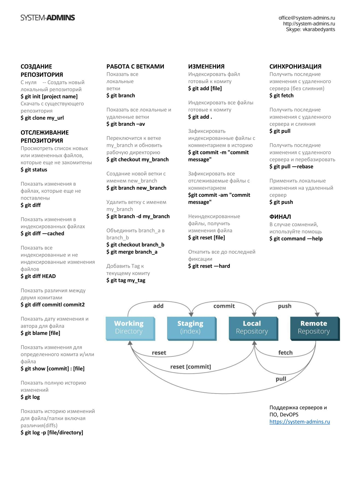

# oh-my-skills

### Что это?

Этот репозиторий содержит систематизированную коллекцию материалов о составляющих различных экосистем (основные концепции, ОС, языки и среды разработки, фреймворки, API, различные утилиты, базы данных, безопасность, тестирование и пентест и др.), с которыми сталкиваются современные квалифицированные разработчики.

> Репозиторий изначально создавался для личных нужд как справочник, но, возможно, будет полезен широкому кругу специалистов.
> Большая часть материалов касается работы на ОС стека MacOS и Linux, поскольку автору они ближе, чем остальные.
> Репозиторий не является полным справочником по всему и вся и пополняется автором по мере личной необходимости.

В репозитории я постарался собрать максимальное количество ссылок на полезные ресурсы по интересующим меня темам, не вдаваясь в длинные описания технологий и холивары по поводу их использования.

Некоторые книги и мануалы в формате PDF для удобства выложены в отдельный репозиторий:

> https://github.com/bormaxi8080/programming-books

## Содержание:

- [Основные понятия и концепции](#основные-понятия-и-концепции)
- [Операционные системы](#операционные-системы)
- [Виртуальные машины](#виртуальные-машины)
- [Базы данных](#базы-данных)
- [Языки программирования](#языки-программирования)
- [Популярные IDE](#популярные-IDE)
- [Сервера приложений](#сервера-приложений)
- [Библиотеки и фреймворки](#бибилиотеки-и-фреймворки)
- [Мобильная разработка](#мобильная-разработка)
- [Облачные платформы и API](#облачные-платформы-и-api)
- [UX, HTML, CSS, Bootstrap, Material UI и пр.](#ux)
- [Полезные утилиты](#полезные-утилиты)
- [Пентестинг, безопасность и защита](#пентестинг-безопасность-и-защита)
- [Протоколы и стандарты передачи данных](#протоколы-и-стандарты)
- [Разное](#разное)

# Основные понятия и концепции

### Основы работы в ОС семейства Linux. Shell и командная строка

Advanced Bash Scripting Guide: https://www.opennet.ru/docs/RUS/bash_scripting_guide/

Вводная статья по Kali Linux: https://hackware.ru/?p=2767

Oh My Zsh - платформа с открытым исходным кодом для управления вашей конфигурацией Zsh.
Поставляется в комплекте с тысячами полезных функций, помощников, плагинов, тем:
> https://ohmyz.sh/

ExplainShell - отличный сервис для проверки работы командной строки Linux: https://explainshell.com/

### Git:

Официальный сайт и документация: https://git-scm.com/

Блог: https://github.blog

Git за полчаса - руководство для начинающих: https://proglib.io/p/git-for-half-an-hour

Интерактивный курс по Git: https://githowto.com/

Шпаргалка:

Объяснение работы Git на котиках: https://www.khtulhu.org.ua/blog/1085-ob-yasnenie-raboty-git-na-kotikakh.html

О файле .gitignore: https://tyapk.ru/blog/post/gitignore

Token authentication requirements for Git operations: https://github.blog/2020-12-15-token-authentication-requirements-for-git-operations/

### Markdown:

Краткое руководство по MD: https://paulradzkov.com/2014/markdown_cheatsheet/

Grip - утилита для автономного просмотра разметки MD:
> https://github.com/joeyespo/grip
> 
> Запуск: grip

# Операционные системы

### MacOS

Официальное руководство пользователя MacOS: https://support.apple.com/ru-ru/guide/mac-help/welcome/mac

MacAppStore - Search and Install any app on MacOS: https://macappstore.org/

Homebrew Formulae - online package browser for Homebrew: https://formulae.brew.sh/

MacBug - хороший сайт о программировании под MacOs, iOS: http://macbug.ru/

Яблык - все про Apple: https://yablyk.com/

### Ubuntu

Официальный сайт и документация: https://ubuntu.com/

Про Ubuntu на русском: https://ubuntu.ru/

### Debian

Официальный сайт и документация: https://www.debian.org/

В чём разница между Debian и Ubuntu? Что лучше выбрать: https://habr.com/ru/company/ruvds/blog/576380/

### Kali Linux

Официальный сайт и документация: https://kali.org

Перевод официальной документации: https://hackware.ru/?p=2767

Небольшая вводная статья: https://teletype.in/@hackerseverywhere/BympqZiD4

### Balena Etcher - создание образов дисков на MacOS

Официальный сайт: https://www.balena.io/etcher/

На русском: https://balena-etcher.com/

# Виртуальные машины

### Oracle VM VirtualBox

Официальный сайт и документация: https://www.virtualbox.org/

Образы для Windows: https://g-ek.com/skachat-oficzialnyie-virtualnyie-mashinyi-windows-10

Образы для Linux:

> Ubuntu: https://www.linuxvmimages.com/images/ubuntu-2004/
> 
> Kali Linux: https://www.kali.org/get-kali/
> 
> MacOS High Sierra: https://betacode.net/12025/install-mac-os-virtual-machine-in-virtualbox

# Базы данных

### Теория и основные концепции работы с БД

### MySQL

Официальный сайт и документация: https://www.mysql.com/

Мануалы:

> http://www.mysql.ru/docs/
> 
> https://metanit.com/sql/mysql/

Оригинальный API для MySQL- PHP: https://www.php.net/manual/ru/book.mysql.php

### MariaDB

Официальный сайт и документация: https://mariadb.com/

MariaDB foundation: https://mariadb.org/

История проекта: https://ru.wikipedia.org/wiki/MariaDB

Установка на MacOS: https://mariadb.com/kb/en/installing-mariadb-on-macos-using-homebrew/

### PostrgeSQL

Официальный сайт и документация: https://www.postgresql.org/

Руководство на Metanit: https://metanit.com/sql/postgresql/

Хорошие туториалы на английском: https://www.postgresqltutorial.com/

PostgresPro: https://postgrespro.ru

### SQLite

Официальный сайт и документация: https://www.sqlite.org

### MongoDB

Официальный сайт и документация: https://www.mongodb.com/

Twitter: https://twitter.com/MongoDB

Руководство на Metanit: https://metanit.com/nosql/mongodb/

Руководство на CoderLessons: https://coderlessons.com/tutorials/bazy-dannykh/uchitsia-mongodb/mongodb-kratkoe-rukovodstvo

Примеры работы на Node.js: https://nodejsdev.ru/doc/mongodb/

# Языки программирования

### JavaScript

Исчерпывающая информация на русском: https://javascript.ru/

Современный учебник по JavaScript: https://learn.javascript.ru/

Вот этот парень у себя в LinkedIn делает классные мануалы/примеры кода по JS: https://www.linkedin.com/in/sam-shpakov/

### TypeScript:

Running and debugging TypeScript in JetBrains WebStorm: https://www.jetbrains.com/help/webstorm/running-and-debugging-typescript.html

### C++

Официальный сайт стандарта C++: https://isocpp.org/

Большой сайт по C++, документация: https://www.cplusplus.com/

Туториалы: https://www.w3schools.com/cpp/cpp_intro.asp

### Rust

Официальный сайт и документация: https://www.rust-lang.org/

Rust в примерах: https://doc.rust-lang.ru/stable/rust-by-example/

Русскоговорящее сообщество Rust: https://rust-lang.ru/

Разбор особенностей и некоторые ссылки: https://habr.com/ru/post/433302/

### Java

Официальный сайт: https://www.java.com/

На русском: https://www.java.com/ru/

Официальная документация: https://dev.java/

Хаб на Habr: https://habr.com/ru/hub/java/

Раздел на Metanit: https://metanit.com/java/

### Scala

Официальный сайт и документация: https://www.scala-lang.org/

Хаб на Habr: https://habr.com/ru/hub/scala/

### Python

Официальный сайт и документация: https://www.python.org/

Материалы по Python на TProger: https://tproger.ru/tag/python/?page=2

Хаб на Хабре: https://habr.com/ru/hub/python/

Find, install and publish Python packages with the Python Package Index (поисковик по библиотекам): https://pypi.org

Абстрактные классы и интерфейсы в Python: https://habr.com/ru/post/72757/

Библиотеки для работы с SQLite: https://pyneng.readthedocs.io/ru/latest/book/25_db/sqlite3.html

### GoLang

Официальный сайт и документация: https://go.dev/

Материалы по Go (отдельный репозиторий): https://gist.github.com/egorsmkv/9df2aef2eddf51986b6d2b5833a4423e

Книги:

> Введение в программирование на Go: http://golang-book.ru/

Шпаргалка по структурам данных в Go: https://habr.com/ru/post/456194/

Парсинг файлов CSV в Go: https://golangify.com/parsing-csv

Vegeta - HTTP Load Testing Tool and Library: https://github.com/tsenart/vegeta

### PHP

Официальный сайт и документация: https://www.php.net/

### Ruby, RubyOnRails

Ruby - официальный сайт и документция: https://www.ruby-lang.org/ru/

RubyOnRails: https://rubyonrails.org/

Чем хорошо RubyOnRails и как он ускоряет разработку: https://habr.com/ru/company/skillbox/blog/428487/

Хороший сайт на русском: http://www.rubyonrails.ru/

### Perl

Официальный сайт и документация: https://www.perl.org/

Хаб на Хабре: https://habr.com/ru/hub/perl/

Краткий экскурс в Perl-программирование: https://www.opennet.ru/docs/RUS/perl_help/

Perl plugin для IntelliJ Idea:
> https://habr.com/ru/post/265799/
> 
> https://habr.com/ru/post/301910/

### Lua

Официальный сайт и документация: https://www.lua.org/

Lua за 15 минут:
> https://habr.com/ru/post/184538/
> 
> http://tylerneylon.com/a/learn-lua/

Хороший мануал на русском: https://docs.geoscan.aero/ru/master/programming/lua/lua_main.html

Хаб на Хабре: https://habr.com/ru/hub/lua/

### Erlang

Официальный сайт и документация: https://www.erlang.org/

Краткое руководство на CoderLessons: https://coderlessons.com/tutorials/kompiuternoe-programmirovanie/vyuchit-erlang/erlang-kratkoe-rukovodstvo

Руководство по программированию на языке Erlang: https://pessim50.ucoz.ru/Erlang.pdf

Специфика:
> https://eax.me/erlang-is-specific/
> 
> https://habr.com/ru/post/50028/

# Популярные IDE

### Cемейство IDE от JetBrains

Официальный сайт и документация: https://www.jetbrains.com/

### Eclipse IDE

Официальный сайт и документация: https://www.eclipse.org/ide/

# Сервера приложений

### Node.js

"Официальные" руководства: https://nodeguide.ru/doc/

Руководство на Habr: https://habr.com/ru/company/ruvds/blog/422893/

Сайт для разработчиков Node.js: https://nodejsdev.ru/

Полная версия руководства на Habr + PDF: https://habr.com/ru/company/ruvds/blog/428576/

Руководство на Metalint: https://metanit.com/web/nodejs/

Управление версиями Node.js и NPM с помощью NVM: https://habr.com/ru/company/timeweb/blog/541452/

Using Node in JetBrains WebStorm: https://www.jetbrains.com/help/webstorm/developing-node-js-applications.html#ws_node_version

Книги:

> https://monster-book.com/node-js
>
> https://habr.com/ru/company/ruvds/blog/428576/

Express:

> Официальный сайт и документация: https://expressjs.com/ru/
> 
> GitHub: https://github.com/expressjs/express
>
> NPM: https://www.npmjs.com/package/express
>
> Руководство от Mozilla: https://developer.mozilla.org/ru/docs/Learn/Server-side/Express_Nodejs

Async:

> https://caolan.github.io/async/v3/docs.html
> 
> Руководство от Mozilla: https://developer.mozilla.org/ru/docs/Learn/Server-side/Express_Nodejs/Displaying_data/flow_control_using_async

Lodash:

> https://lodash.com/docs/
> 
> https://github.com/lodash/lodash
>
> https://www.npmjs.com/package/lodash
>
> https://habr.com/ru/post/217515/

Node-fetch:

> https://www.npmjs.com/package/node-fetch

Chalk - раскраска терминала:

> https://github.com/chalk/chalk

Debug:

> https://www.npmjs.com/package/debug
>
> https://developer.ibm.com/articles/intro-to-the-nodejs-debug-module/

Puppeteer - скрапинг web-сайтов:

> https://github.com/puppeteer/puppeteer
>
> https://www.npmjs.com/package/puppeteer-full-page-screenshot
> 
> https://habr.com/ru/company/oleg-bunin/blog/421137/
>
> https://habr.com/ru/company/ruvds/blog/341348/
>
> https://habr.com/ru/post/413547/

Lerna:

> https://github.com/lerna/lerna

Модули node для работы с SQLite:

> https://github.com/grumdrig/node-sqlite
>
> https://github.com/mapbox/node-sqlite3
>
> https://github.com/grumdrig/node-sqlite
> 
> https://www.npmjs.com/package/better-sqlite3
> 
> Что выбрать: https://coderoad.ru/14355004/%D0%A7%D1%82%D0%BE-SQLite-%D0%B8%D1%81%D0%BF%D0%BE%D0%BB%D1%8C%D0%B7%D0%BE%D0%B2%D0%B0%D1%82%D1%8C-%D1%81-nodejs
> 
> Визуализация SQLite в Node.js: https://habr.com/ru/company/vdsina/blog/527146/

Примеры работы с MongoDB: https://nodejsdev.ru/doc/mongodb/

### NATS

https://nats.io/

### Redis - Open source in-memory data structure store, used as a database, cache, and message broker

Официальный сайт и документация: https://redis.io/

Вводная на AWS: https://aws.amazon.com/ru/redis/

Redis для начинающих: https://webdevblog.ru/redis-dlya-nachinajushhij/

Шпаргалка по Redis на Хабре: https://habr.com/ru/post/204354/

Маленькая книга о Redis: https://3s.group/upload/iblock/890/890258c1a79e7154773b210ea701b184.pdf

Redis в Python - полная документация на примерах: https://python-scripts.com/redis

Redis Queue в Python: https://khashtamov.com/ru/python-rq-howto/

### Memcached - a distributed memory object caching system

Официальный сайт и документация: https://memcached.org/

Маленькая вводная: https://habr.com/ru/post/42607/

Описание от AWS, сравнение с Redis: https://aws.amazon.com/ru/memcached/

### RabbitMQ message broker

Официальный сайт и документация: https://www.rabbitmq.com/

Введение в RabbitMQ: https://habr.com/ru/post/488654/

### Celery async message queue

Официальный сайт и документация: http://celeryproject.org/

GitHub: https://github.com/celery/celery

Введение в Celery: https://docs.celeryproject.org/en/stable/getting-started/introduction.html

Celery - лучшие практики: https://habr.com/ru/post/269347/

Celery - начинаем правильно: https://khashtamov.com/ru/celery-best-practices/

Django и Celery (в связке): https://django.fun/tutorials/django-i-celery-1-ustanovka/

Пакет django-celery: https://github.com/adilkhash/django-celery

Flower - web based tool for monitoring and administrating Celery clusters: https://github.com/mher/flower

### Tarantool - платформа in-memory вычислений

Официальный сайт и документация: https://www.tarantool.io/

# Библиотеки и фреймворки

Подробный roadmap по backend технологиям вынесен в отдельный репозиторий, форк: https://github.com/bormaxi8080/oh-my-backend

### Серверное программирование web-сайтов - официальные рекомендации от Mozilla:

> https://developer.mozilla.org/ru/docs/Learn/Server-side

### Telegram

Управление ботами в Telegram:

> https://tlgrm.ru/docs/bots#botfather
>
> https://vc.ru/selectel/22593-howto-bot-selectel

AIOgram async framework:

> GitHub: https://github.com/aiogram/aiogram
> 
> Официальная документация: https://docs.aiogram.dev/en/latest/
> 
> Быстрый старт: https://surik00.gitbooks.io/aiogram-lessons/content/chapter1.html
> 
> Еще интересные статьи:
> 
> https://tproger.ru/articles/telegram-bot-create-and-deploy/
> 
> https://mastergroosha.github.io/telegram-tutorial-2/quickstart/
> 
> Подключение оплат: https://vc.ru/dev/240195-kak-nastroit-priem-platezhey-2-0-v-telegram-za-5-chasov

Как настроить прием платежей 2.0 в Telegram за 5 часов: https://vc.ru/dev/240195-kak-nastroit-priem-platezhey-2-0-v-telegram-za-5-chasov

### Go Hugo:

Creating Hugo Themes: https://draft.dev/learn/creating-hugo-themes

Create Your Own Hugo Theme (большое полное видео): https://www.youtube.com/watch?v=wcMqrb3v2SM

Легкое создание сайтов на Hugo: https://code.tutsplus.com/ru/tutorials/make-creating-websites-fun-again-with-hugo-the-static-website-generator-written-in-go--cms-27319

### Docker

> Официальная документация: https://docs.docker.com/
> 
> Старт: https://tproger.ru/translations/how-to-start-using-docker/
> 
> Полное практическое руководство на русском: https://habr.com/ru/post/310460/

### React

> Learn React.js - Полное руководство: https://learn-reactjs.ru/home
>
> Figmachine - Convert Figma to React Code: https://www.figmachine.com/

### Django

Официальный сайт и документация: https://www.djangoproject.com/

Документация от Mozilla: https://developer.mozilla.org/ru/docs/Learn/Server-side/Django

Неплохая документация на русском: https://djbook.ru/rel3.0/

Хаб по Django на Хабре: https://habr.com/ru/hub/django/

Django fun:

> https://django.fun/
> 
> Статьи о Django: https://django.fun/tutorials/

### Браузерные расширения Chrome и Firefox:

> Как посмотреть исходный код любого расширения в браузере: https://mipped.com/polezno/9742-kak-posmotret-ishodnyy-kod-lyubogo-rasshireniya-v-brauzere.html

# Мобильная разработка

### iOS

Objective C:

> Официальная документация от Apple: https://developer.apple.com/library/archive/documentation/Cocoa/Conceptual/ProgrammingWithObjectiveC/Introduction/Introduction.html
> 
> Objective C с нуля: https://habr.com/ru/post/107126/

Swift:

> Официальный сайт и документация: https://www.swift.org/
> 
> Официальная документация от Apple: https://developer.apple.com/documentation/swift
> 
> Хаб на Habr: https://habr.com/ru/hub/swift/

Cocoa:

> Официальная документация от Apple: https://developer.apple.com/library/archive/documentation/Cocoa/Conceptual/CocoaFundamentals/WhatIsCocoa/WhatIsCocoa.html
> 
> Учебник на русском: http://macbug.ru/cocoa.php
> 
> Хаб на Habr: https://habr.com/ru/hub/cocoa/

### Android

Android Developers Community: https://developer.android.com/

Android Official Documentation: https://developer.android.com/

Android Studio: https://developer.android.com/studio

Android JetPack: https://developer.android.com/jetpack

Android.com на русском: https://www.android.com/intl/ru_ru/

Хаб на Habr: https://habr.com/ru/hub/android_dev/

Kotlin:

> Develop Android apps with Kotlin (official): https://developer.android.com/kotlin

# Облачные платформы и API

### Google Translate API:

Официальная документация: https://cloud.google.com/translate

API является платным, но есть множество обходных путей:

> https://qna.habr.com/q/16856
>
> https://coderoad.ru/43155233/Google-Translate-API-%D0%BF%D0%BB%D0%B0%D1%82%D0%BD%D1%8B%D0%B9-%D0%BF%D1%80%D0%BE%D1%82%D0%B8%D0%B2-Google-Translate-API-%D0%B1%D0%B5%D1%81%D0%BF%D0%BB%D0%B0%D1%82%D0%BD%D1%8B%D0%B9

# HTML, CSS, Bootstrap, UX, Material UI

### HTML

HTML Tutorials: https://www.w3schools.com/html/

Документация от Mozilla: https://developer.mozilla.org/ru/docs/Web/HTML

Справочник по HTML: http://htmlbook.ru/html

### HTML5

Справочник по HTML5: https://html5book.ru/html-html5/

Погружение в HTML5: http://htmlbook.ru/html5

Различия меду HTML(4) и HTML5: https://www.hostinger.ru/rukovodstva/chto-takoe-html-i-ih-razlichiya

### CSS

CSS Tutorials: https://www.w3schools.com/css/default.asp

Документация от Mozilla: https://developer.mozilla.org/ru/docs/Learn/Getting_started_with_the_web/CSS_basics

Самоучитель CSS: http://htmlbook.ru/samcss

CSS для начинающих: https://ru.code-basics.com/languages/css

### Bootstrap

Официальный сайт и документация: https://getbootstrap.com/

Создание быстрых отзывчивых сайтов с Bootstrap. Документация на русском: https://bootstrap-4.ru/

### Material UI

Официальный сайт и документация: https://mui.com/

Reactjs, Material-UI with JSS. Краткий гайд: https://habr.com/ru/post/492378/

MUI React templates & tools satore: https://material-ui.com/store/

Material Design:

> https://material.io/
> 
> https://material.io/components

### UX

UX Club - самое большое российское коммьюнити по UX: https://www.facebook.com/groups/136827946465842

# Полезные утилиты

### Prometheus - metrics and alerting with the leading open-source monitoring solution:

Официальный сайт и документация: https://prometheus.io/

Вводная статья на Habr: https://habr.com/ru/company/southbridge/blog/455290/

### Grafana - operational dashboards

Официальный сайт и документация: https://grafana.com/

GitHub: https://github.com/grafana/grafana

Пример внедрения: https://habr.com/ru/company/southbridge/blog/431122/

### Chipmunk - утилита для работы с большими логами:

GitHub: https://github.com/esrlabs/chipmunk 

Описание на Habr: https://habr.com/ru/post/496126/

# Пентестинг, безопасность и защита

### SecurityLab - Soft: огромная подборка всякого разного софта:

https://www.securitylab.ru/software/

### "Mac на службе у хакера" - хорошая серия статей для начинающих пентестеров.

Часть 1 - Шифрование диска: https://www.securitylab.ru/analytics/491107.php

Часть 2 - Создание образа шифрованного диска: https://www.securitylab.ru/analytics/491268.php

Часть 3 - Управление паролями: https://www.securitylab.ru/analytics/491893.php

Часть 4 - Установка iTerm2: https://www.securitylab.ru/analytics/492394.php

 Часть 5 - Использование Git: https://www.securitylab.ru/analytics/492395.php

Часть 6 - Настройка Homebrew: https://www.securitylab.ru/analytics/492845.php

Часть 7 - Установка RVM для работы с Ruby: https://www.securitylab.ru/analytics/492846.php

Часть 8 - Установка Kali Linux на виртуальной машине: https://www.securitylab.ru/analytics/492847.php

Часть 9 - Установка Metaspoloit Framework: https://www.securitylab.ru/analytics/492848.php

Часть 10 - Упорядочивание утилит: https://www.securitylab.ru/analytics/492935.php

### Honeypots:

Хорошая вводная статья про инструментарий: https://habr.com/ru/company/alexhost/blog/528796/

### Wireshark

Официальный сайт и документация: https://www.wireshark.org/

Небольшое руководство и шпаргалка: https://habr.com/ru/post/436226/

Огромное количество инструкций и примеров: https://networkguru.ru/wireshark/

### Telnet:

Простые примеры: https://losst.ru/kak-polzovatsya-telnet

Документация от Microsoft: https://docs.microsoft.com/ru-ru/windows-server/administration/windows-commands/telnet

### Команда dig (domain information groper) - многофункциональный инструмент для опроса DNS-серверов:

https://andreyex.ru/linux/komandy-linux-i-komandy-shell/kak-ispolzovat-komandu-dig-dlya-zaprosa-dns-v-linux/

https://greendail.ru/node/474

https://losst.ru/komanda-dig-v-linux#:~:text=%D0%9A%D0%BE%D0%BC%D0%B0%D0%BD%D0%B4%D0%B0%20dig%20(domain%20information%20groper,%D0%B0%D0%B4%D0%BC%D0%B8%D0%BD%D0%B8%D1%81%D1%82%D1%80%D0%B0%D1%82%D0%BE%D1%80%D0%B0%D0%BC%20%D0%B4%D0%BB%D1%8F%20%D0%B2%D1%8B%D1%8F%D0%B2%D0%BB%D0%B5%D0%BD%D0%B8%D1%8F%20%D0%BD%D0%B5%D0%B8%D1%81%D0%BF%D1%80%D0%B0%D0%B2%D0%BD%D0%BE%D1%81%D1%82%D0%B5%D0%B9%20DNS

### NMap

https://nmap.org/npcap/guide/

Сканирование через скрипты обнаружения уязвимостей: 

> https://github.com/scipag/vulscan (nmap -sV --script vulners domain.com)
>
> https://github.com/vulnersCom/nmap-vulners (nmap -sV --script=vulscan.nse domain.com)
 
Автоматизированный shell: https://github.com/bormaxi8080/nmap-scanner

Несколько интересных статей:

> https://habr.com/ru/post/88064/
> 
> https://losst.ru/kak-polzovatsya-nmap-dlya-skanirovaniya-seti
>
> https://antiddos.biz/kak-polzovatsya-nmap-dlya-poiska-uyazvimostej-servera/
 
Еще некоторые примеры: https://xakinfo.ru/os/nmap-anonymous/

### Metasploit Framework

https://www.metasploit.com/

Официальная документация: https://docs.rapid7.com/metasploit/

Установка: https://github.com/rapid7/metasploit-framework/wiki/Nightly-Installers

Обзоры:
 
> https://habr.com/ru/company/varonis/blog/528578/
>
> https://vc.ru/life/136613-metasploit-framework-kratkoe-prakticheskoe-rukovodstvo
 
Гид по Metasploit Framework от SecurityLab: https://www.securitylab.ru/blog/personal/Informacionnaya_bezopasnost_v_detalyah/323370.php

### theHarvester:

https://github.com/laramies/theHarvester

### hydra:

https://null-byte.wonderhowto.com/how-to/hack-like-pro-crack-online-passwords-with-tamper-data-thc-hydra-0155374/

### Nikto (Nikto2):

https://cirt.net/Nikto2

### WPScan - мощный фреймворк для пентеста WordPress:

https://wpscan.com/wordpress-security-scanner
 
GitHub: https://github.com/wpscanteam/wpscan

https://habr.com/ru/company/alexhost/blog/527612/

### Vulners Perimeter Scanner: https://vulners.com/vulners-perimeter-scanner

# Web Scraping:

GetData.io Web Scraper: https://chrome.google.com/webstore/detail/web-scraper-getdataio/ofncgcgajhgnbkbmkdhbgkoopfbemhfj?hl=ru&ref=hrstack

OSINTGram - собираем данные из Instagram:

> https://telegra.ph/OSINTGRAM-Sobiraem-dannye-iz-Instagram-12-04
>
> GitHub: https://github.com/Datalux/Osintgram

# Протоколы и стандарты передачи данных

### RFC и IETF:

Полный список стандартов RFC: https://www.rfc-editor.org/standards

Наиболее популярные RFC: https://ru.wikipedia.org/wiki/%D0%A1%D0%BF%D0%B8%D1%81%D0%BE%D0%BA_RFC

IETF Data Tracker (поиск полного описания RFC по номеру): https://datatracker.ietf.org/

### DNS:

Простое описание: https://ru.wikipedia.org/wiki/DNS

Записи DNS: https://ru.wikipedia.org/wiki/DNS#%D0%97%D0%B0%D0%BF%D0%B8%D1%81%D0%B8_DNS

Типы ресурсных записей: https://ru.wikipedia.org/wiki/%D0%A2%D0%B8%D0%BF%D1%8B_%D1%80%D0%B5%D1%81%D1%83%D1%80%D1%81%D0%BD%D1%8B%D1%85_%D0%B7%D0%B0%D0%BF%D0%B8%D1%81%D0%B5%D0%B9_DNS#A

MX:

> https://ru.wikipedia.org/wiki/%D0%97%D0%B0%D0%BF%D0%B8%D1%81%D1%8C_MX
>
> Как проверить MX-запись домена: https://timeweb.com/ru/community/articles/kak-proverit-mx-zapis-domena

### SMTP:

Простое описание протокола SMTP:

> https://ru.wikipedia.org/wiki/SMTP
>
> http://www2.icmm.ru/~masich/win/lexion/mail/smtp.html#relay

Catch-all:

> https://ru.wikipedia.org/wiki/Catch-all
> 
> https://golb.hplar.ch/2019/08/catch-all-smtp.html
> 
> How to detect if domain has catch all policy to accept email: https://stackoverflow.com/questions/17947198/how-to-detect-if-domain-has-catch-all-policy-to-accept-email

### MTA (Message Transfer Agent):

> Основные принципы: https://ru.bmstu.wiki/MTA_(Message_Transfer_Agent)
> 
> More: https://mailtrap.io/blog/mail-transfer-agent/

# Разное

### Менеджмент, управление, лидерство, корпоративная культура

Умные и честные заметки от Виталия Шароватова, вынесено в отдельный репозиторий, форк:

https://github.com/bormaxi8080/teamlead

### Найм, HR и все, что с этим связано

Вынесено в отдельный репозиторий:

https://github.com/bormaxi8080/bormaxi-about-hiring

# Об авторе

Более подробно с моей биографией можно ознакомиться здесь:

> https://www.linkedin.com/in/i-maxi/

Благодарности и обратная связь:

> Обо всех пожеланиях по поводу содержимого данного репозитория и найденных ошибках можно сообщить в комментариях или в Telegram: @bormaxi
>
> Донаты в благодарность принимаются на карту Tinkoff: 5536 9138 6607 4988
или на Etherium: 0xe29685d6f0032bccac08b0e745a1a69ef9803973
